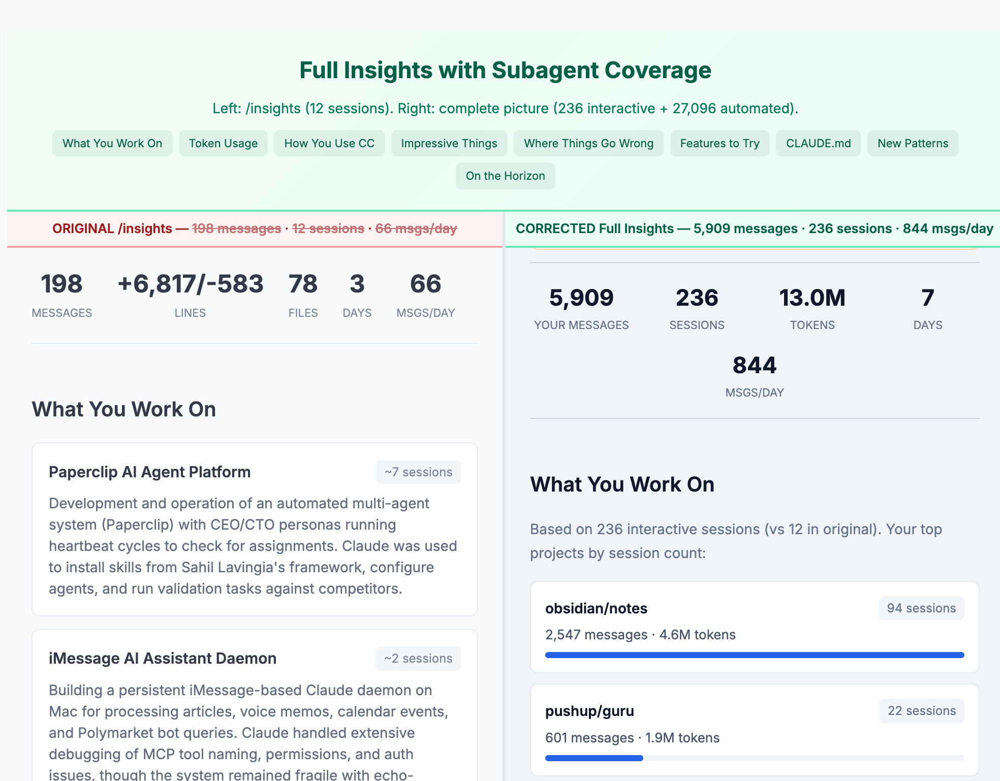

# Better Insights for Claude Code

**`/insights` told me I send 66 messages a day. The real number is 844.**

The built-in `/insights` counts tool results as your messages (inflating ~7x), only analyzes ~12 sessions, and misses older sessions after data migrations. This fixes all of that: scans everything, separates what you typed from what the API generated, reports token usage and model breakdown.



## Install as a skill

```bash
npx github:sawasawasawa/better-insights-claude-code install
```

Then type `/full-insights` in any Claude Code session.

## Or run directly

```bash
npx github:sawasawasawa/better-insights-claude-code              # Last 7 days
npx github:sawasawasawa/better-insights-claude-code --days=30    # Last 30 days
npx github:sawasawasawa/better-insights-claude-code --all        # All time
npx github:sawasawasawa/better-insights-claude-code --json       # JSON only
```

## What it fixes

| | /insights | Better Insights |
|---|---|---|
| Messages | Counts tool results as yours (~7x) | Human messages only |
| Sessions | Analyzes ~12 | Scans all |
| Coverage | Misses migrated sessions | Both paths |
| Agents | No awareness | Interactive vs automated vs subagent |
| Tokens | Not reported | Input, output, cache breakdown |
| Models | Not reported | Per-model counts |

## Why /insights undercounts

**Tool result inflation**: The Claude API sends tool results as `role: "user"`. `/insights` counts these as your messages. ~85% of "user" messages are tool results.

**Missing sessions**: Claude Code moves older sessions to a nested path during upgrades. `/insights` only reads the new path.

## License

MIT
